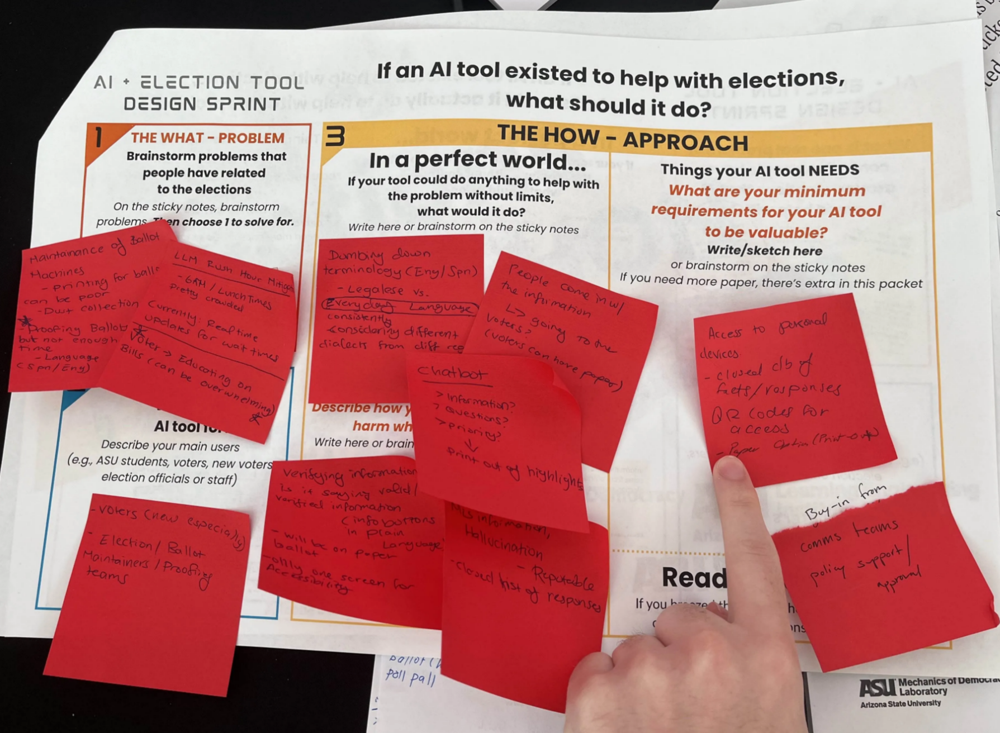
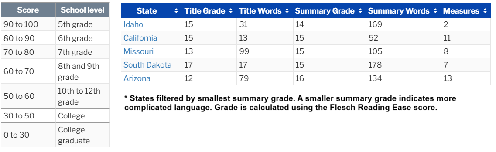
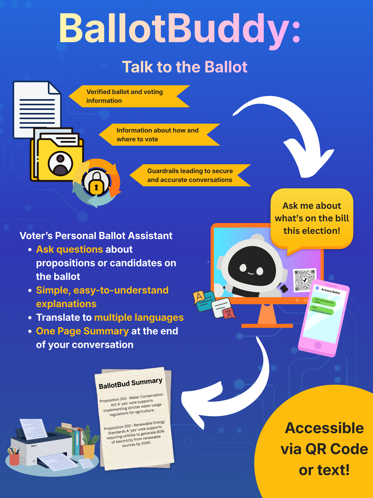
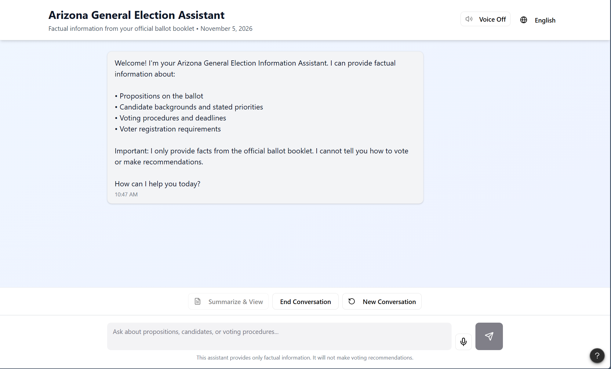
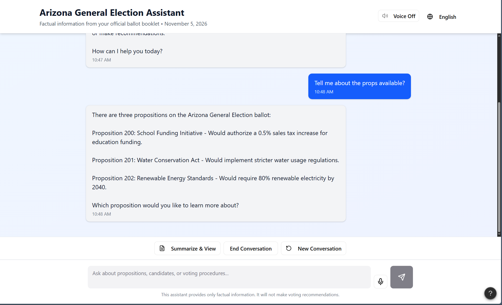
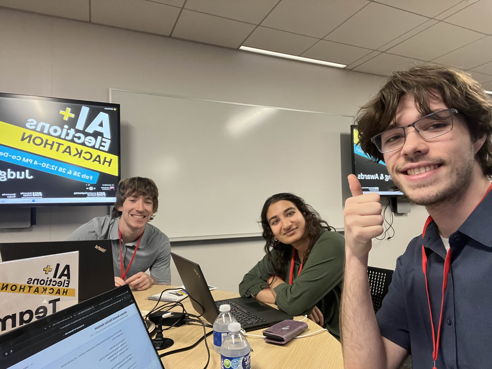

import Callout from '@/components/Callout.astro'

# AI Elections Hackathon

Last week I was able to be a part of the AI + Elections Hackathon hosted by [Dr. Allison Lester](https://www.linkedin.com/in/allisonjoann/) in collaboration with ASU’s [Mechanics of Democracy Lab](https://www.linkedin.com/company/asu-mechanics-of-democracy-lab/posts/?feedView=all).

The team composed of myself, [Nick](https://www.linkedin.com/in/nicholas-mitich/), and [Hrisika](https://www.linkedin.com/in/hrisika-j-0573ab1a9/). Make sure to check my friends out!

Usually I’d have no interest in politics or elections, but when I saw ‘AI’, I felt like I could be useful.

This wasn’t a traditional ‘hackathon’ where we’d be expected to hack and code something up, but instead was a ‘no-code’ hackathon.

---

## Premise

<Callout type="note">
The core hope for the hackathon was to design ways for AI (specifically LLMs) to be utilized in upcoming elections.
</Callout>

Day 1 had 17 teams working with local election officials to brainstorm a common problem found in elections, and design a solution that utilizes AI. Then we would all present our solutions to a small set of judges, and be passed for the next day. These teams would then go through another round of workshopping and designing for one more round of judging.

---

# Day 1

For day 1, we were matched with Karen, an election official in charge of approving what gets put on the ballot for varying languages, and [Robin](https://www.linkedin.com/in/robin-vande-werken-95481579/), a head AI advisor with a focus in making AI secure in industry.

From the conversations with them, we learned a few key things: firstly, ballots are confusing! Karen described problems in translating ballot definitions for English to Spanish dialects. Specifically, we recognized the need for translations for a broad range of languages and local dialects.

Speaking with Robin, she reiterated the need for a responsible AI with guidelines. With as important a task as elections, it would be catastrophic for the AI to output incorrect or harmful information.

We then singled out our problem and solution, and waited to see if we made it to the second day.

---

### The Problem

<Callout type="warning">
The ballot is illegible to a majority of voters.
</Callout>

Oftentimes, people will go to the polls and see the ballot for the first time. Even though there are descriptions for each bill, it is written in ‘legal-ese’- which makes it hard to understand what you’re actually voting for, and the downstream effects it will have on the community.

Ballotpedia has really good research into this, and if you want to understand your states ballot readability score, you can find that here:  
https://ballotpedia.org/Ballot_measure_readability_scores,_2024#States

Specifically, I learned that Arizona (in 2024 at least) had one of the lowest summary grades in the country, with summaries at a Masters-Doctorate reading level.

This discrepancy creates a gap where voters will choose to either not know what they are voting for, or not make a choice at all- even though the bill may directly affect them.

There is no doubt that people should be encouraged and supported to participate in voting for bills that affect them.

---

### Our Solution

How can we use AI to solve this?

Well, LLM’s like ChatGPT, Gemini, Claude, etc. are near-perfect candidates.

These models have become amazing tools for: fact extraction, summarization, re-wording, and other natural language tasks.

<Callout type="info">
Our team set-out to create BallotBuddy (name pending), an AI-assistant made to allow users to “talk to the ballot”.
</Callout>

They’d be able to ask about propositions, candidates, what different communal organizations are saying, and ask clarifying questions when needed. At the end of a user’s conversation, they’d then be able to print out a customized summary that they can bring to the polls.

*Phone rules vary by county I believe, but our Arizona representative said they are not allowed (mainly to prevent recording/filming 75ft of the premises).

---

# Day 2

On Day 2, we were able to refine our pitch and prototype a bit more while gathering feedback from the judges. This round consisted of only 6 teams, and we would be competing for top 3 (and a cash prize as a bonus if we placed). I also imagine that first, second, and third place would have more support for the product actually being created- either through ballot officials or personally with the judges.

The first judge we talked to was [Dana Lewis](https://www.linkedin.com/in/dana-lewis-9b15533ab/), the Pinal country Recorder. We had a great conversation about where voters are actually getting their information from. A more democratic voter will usually get their information from left-leaning sources, and same with a more republican voter. But what about the independent voter?

She cited issues revolving around how people don’t know where to gather information about elections. What do candidates support? What does this bill mean? People would even call the Recorder’s office asking these types of questions.

She also questioned if the tool would be accessible for all Arizona groups. There is a large amount of Tribal Communities here, with some not even having a written language.

<Callout type="important">
Working together we realized that working with the community to ensure accessibility would be just as important as ensuring safe and reliable AI practices.
</Callout>

This accessibility would become a core pillar of our product.

Further deliberating- we prepared all we could for the final round of judging.

*Visual mockups and mini-prototype using Figma

---

# Finals

At this point, me and my friends were all prepared. The idea is pretty simple, and has been reflected in many large industries (mainly as chatbots; eg. TurboTax, Uhaul, etc.). After pitching to 6 judges, we were finally able to relax and let the event continue.

Although we didn’t place top 3, I learned a lot about what I am passionate about.

<Callout type="success">
My interest in AI primarily comes from the want to make technology more helpful and safe for others.
</Callout>

Additionally, this problem matters to me from my Arizona background, and actual experience having trouble staying involved and invested in politics!

---

# Final Comments

Thinking of ways to create solutions in these areas was a fun exercise, and being able to get involved with the community and officials made an impact on me.

We are in talks to continue this project independently, or with one of the judges- but we will have to see. From school to finding summer internships, I’ve been fairly busy. Thankyou for reading!