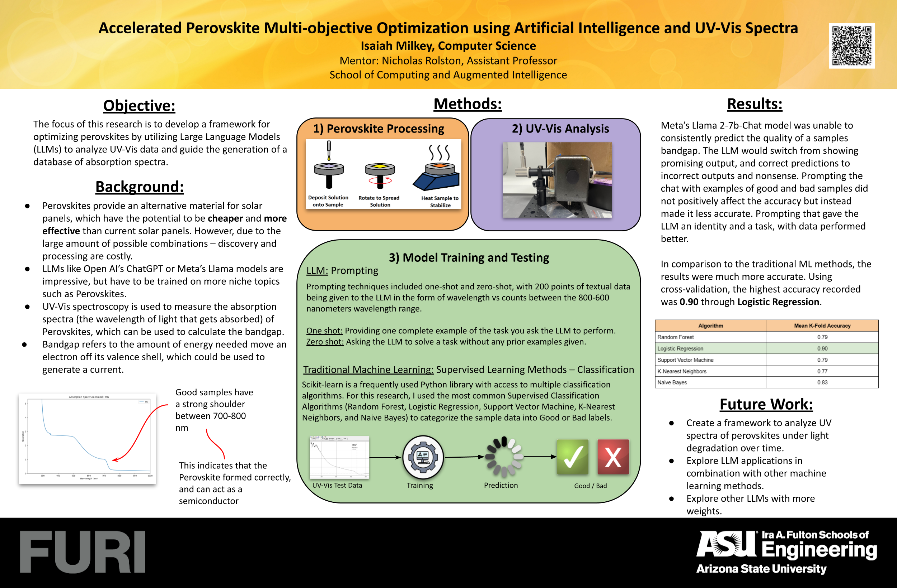
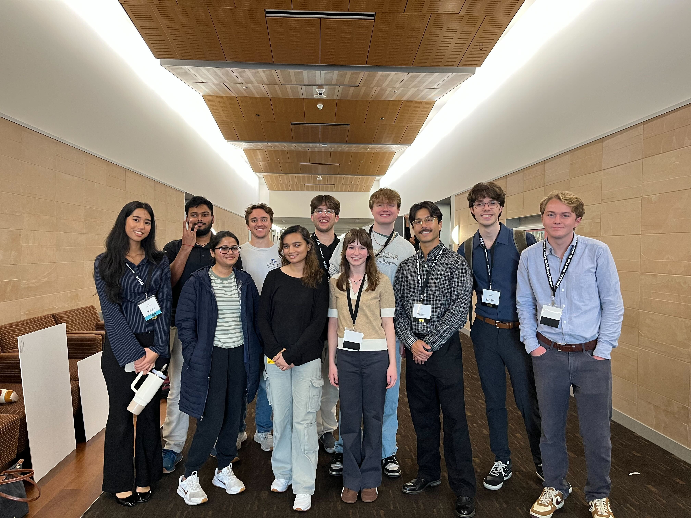

import Callout from '@/components/Callout.astro'
import { Icon } from 'astro-icon/components'

# Poster Presentation: FURI 2025

Last Fall, I got the opportunity to present my research at Fulton Forge: an ASU-hosted event for students who got accepted into FURI (Research Experience for Undergraduates) to present their work.

---

## The Research

<Callout variant="definition">
  This research focuses on combining perovskite characterization with machine learning analysis.
</Callout>

Perovskites are commonly known to be the potential successor to current-day silicon solar cells. However, due to their lack of long-term reliability and complex manufacturing, they have yet been viable in the market.

One way of characterizing perovskite materials is through UV-Vis analysis, which provides the absorbance spectra which is commonly used to determine the bandgap (a useful metric used for calculating the amount of current they can generate).

We combined ML analysis with LLM analysis to compare the results and usefulness of both approaches.

---

## The Problem

Perovskite materials are a novel material that have the potential to make solar cells even more efficient and lucrative. However, current approaches lack long-term durability and stability.

<Callout variant="problem">
  **How can we accelerate the discovery and optimization of perovskite materials to improve long-term stability and durability?**
</Callout>

---

## Our Solution

To answer this question, I wanted to use my Computer Science and Machine Learning background to provide a straight-forward classification approach.

Additionally, part of my task was to assemble and setup a UV-Vis tool which provides us with absorbance and transmission data. Absorbance is most commonly used to calculate the bandgap of perovskites, a measurement used in determining whether a perovskite is optimal to become a solar cell. Therefore, this data is a good source to make a predictive model off of.

Thus, I wanted to compare the classification accuracy of a small LLM (Llama 2-7b) against traditional ML algorithms (Random Forest, Logistic Regression, SVM, KNN, and Naive Bayes) for identifying optimal Perovskite absorption spectra.

I did this by creating a Python script and using Scikit-learn to train and cross-compare these models.

<Callout variant="explanation">
  For the LLM classification, I used Llama 2-7b on Hugging Face created test sets varying LLM identity, few-shot, and zero-shot prompting.
</Callout>

Since the absorption data can be represented as wavelength-intensity pairs, these data were directly pasted into the prompt.

---

## Findings

### Classical Machine Learning Models

| Model | Mean 5-Fold Accuracy |
|------|----------------------|
| Random Forest | 0.79 |
| **Logistic Regression** | **0.90** |
| Support Vector Machine | 0.79 |
| K-Nearest Neighbors | 0.77 |
| Naive Bayes | 0.83 |

<Callout variant="theorem">
  Cross comparing results showed that Logistic Regression out-performed other models by ~9%!
</Callout>

Furthermore, after I took a look at the weights, there was a clear significance put on the weights between the 700–800 wavelengths, which is where the ‘strong shoulder formation’ lies (a clear indicator of a strong bandgap).

This is a good sign that the model actually learned, and didn’t learn purely the training set.

---

### LLM Performance

| Model | Accuracy |
|------|----------|
| Llama 2-7b | 2 / 10 |

<Callout variant="explanation">
  Due to limitations with accessing more advanced models, we relied on using a less-powerful, free model.
</Callout>

This proved consequential as the model would frequently produce incomprehensible results, or seemed ‘random’.

However I believe that more advanced models will increasingly get better at analyzing and classifying such data.

---

## Takeaways

This opportunity was my first time gaining hands-on experience conducting research, and I’m very lucky I got to create and collect my own data, and conduct my own experiment.

Coming from Computer Science, I had to learn lab skills, how to manage a research project, and the science behind working with materials like Perovskites.

It was very exciting learning how to mix my own solution, and spin coat my own samples (Even though it took a couple tries and long nights to get it down).

<Callout variant="explanation">
  I learned that Computer Science is applicable to near every field of science, and my worldview of opportunity has grown ten-fold realizing the types of problems that I get passionate about.
</Callout>

---

