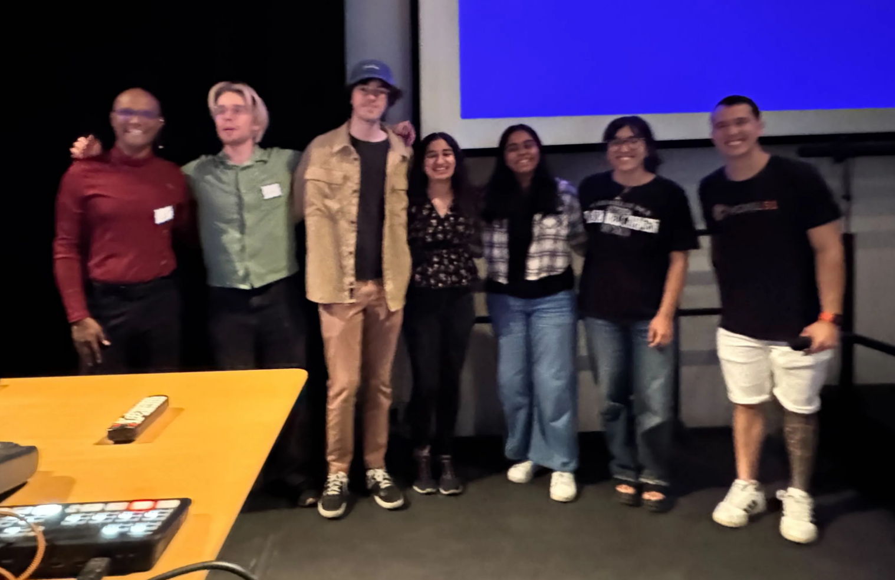
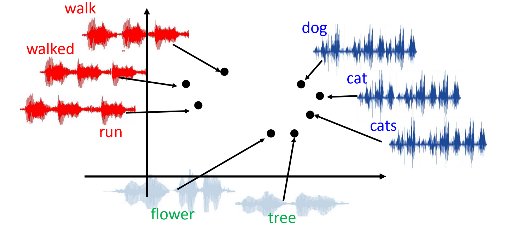
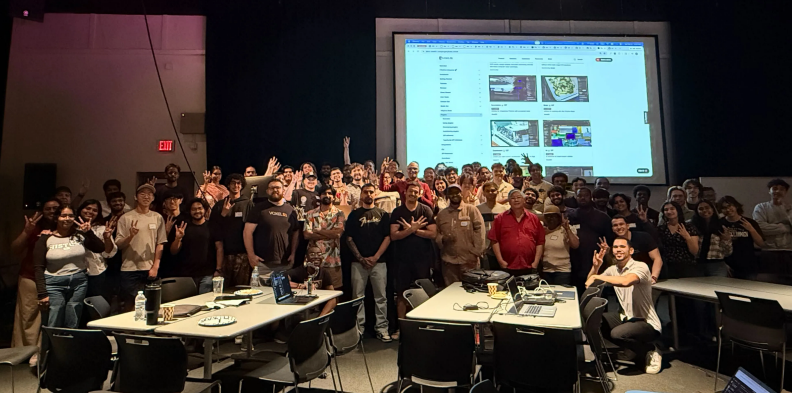

import Callout from '@/components/Callout.astro'
import resonance from './assets/resonance.mp4'

# Winning the Voxel51 Hackathon!

I’ve been super excited to write a little bit about this hackathon.

<Callout variant="summary" title="Result">
Long story short- we won Grand Prize!
</Callout>

# Background:

Incase you aren’t familiar, Voxel51 is a data visualization tool for Python.

<Callout variant="note">
It can display anything from images, videos, NeRF, gaussian splats, embeddings, segmentations, and more. It can be an extremely useful tool when you’re trying to understand your dataset, or interact and edit specific samples interactively rather than having to code a solution.
</Callout>

This hackathon was mainly themed around Agents, and Voxel51 Plugins.

Voxel51 has their own MCP to create plugins, and the main goal was to both learn what and how agents operate, and teach applicants how to create something with their plugin system.

# The Process:

Before the hackathon, me, along with my friends [Vinnie](https://www.linkedin.com/in/vincenzocaggiula/) and [Hrisika](https://www.linkedin.com/in/hrisika-j-0573ab1a9/), all pitched our ideas to develop.

We also made sure to get familiar with the tools and plugins available- which made the actual plugin creation easy!

Vinnie, being a co-music major, is super interested in all things audio- so whatever he was interested in, would relate to that.

Hrisika had an interest in making the plugin visually appealing- and using Javascript/React to make the plugin easy to use and understand.

As for myself, I’m interested in the end use-case, and how whatever we made could actually be used by others. (And of course machine learning).

# Our Plugin: Resonance

One thing I didn’t list in the available data visualizations for Voxel51 is… AUDIO!

Which is incredibly surprising given the many niche types of data it currently offers.

<Callout variant="important" title="Our Goal">
Create a plugin that can display audio embeddings for analysis.
</Callout>

Essentially, we created a plugin where you can display and listen to your dataset of audio files.

The front-end displays the waveform in a clean way, and the back-end automatically partitions the audio into most impactful portions (set by settings when choosing to analyze).

The user can then choose to embed these highlighted sections, by using the Voxel51 Brain.

<video autoPlay loop muted playsInline width="100%">
  <source src={resonance} type="video/mp4" />
</video>

# The Use Case:

But how is this plugin useful?

Well, imagine you are given thousands of audio files, all unlabeled- with little to no metadata describing what the audio actually contains.

You could use audio embeddings to find clusters and anomalies in the dataset!

In theory, audio files of people talking would all group together, and any samples with loud barking would also clump together. Unsupervised of course.

<Callout variant="intuition" title="Why embeddings?">
The beautiful thing about embeddings is that it is un-biased. All samples are embedded the same way, therefore any insights created through clustering can be trusted to be consistent as long as the input is consistent.
</Callout>

*Image from: [Audio2Vec](https://people.csail.mit.edu/weifang/project/spml17-audio2vec/)*

# Final Comments:

From this hackathon I learned so much- the people at Voxel51 were very kind and generous, providing feedback and general advice about the field and our plugin.

The hackathon environment can be stressful- but it really tests us on our ability to quickly learn on our feet, and create something impactful.

<Callout variant="summary">
Many thanks to ASU’s Game School and Voxel51 for hosting the event- and of course the other hackers who we competed alongside.
</Callout>

Here’s a quick video from Voxel51 about the experience as well:

[Watch the Voxel51 recap on LinkedIn](https://www.linkedin.com/posts/voxel51_ai-machinelearning-computervision-activity-7443364566211870720-P4OG?utm_source=social_share_send&utm_medium=member_desktop_web&rcm=ACoAAEKfSNQBK1jD0IVxvw17XQDQ6-3Vi7nzh5U)

